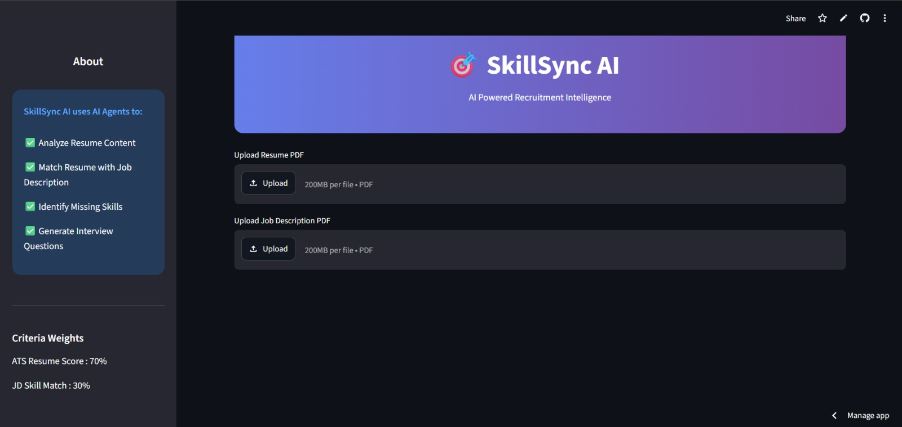
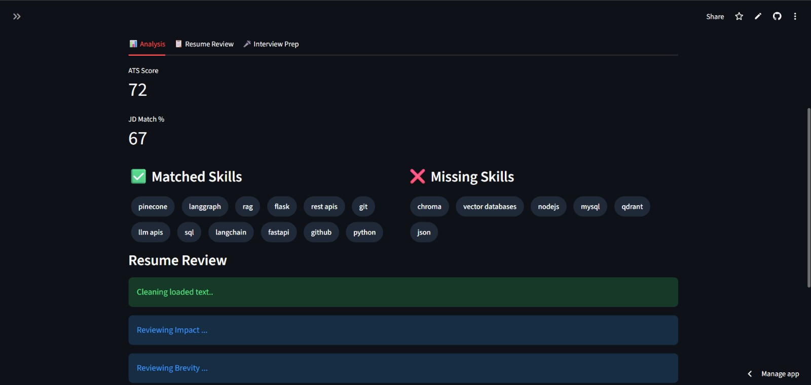
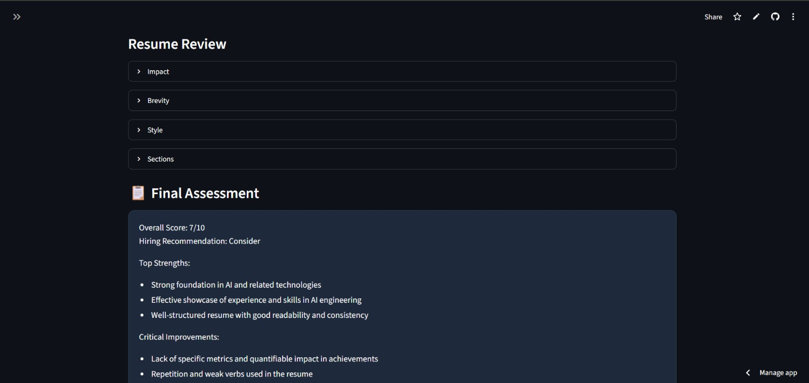
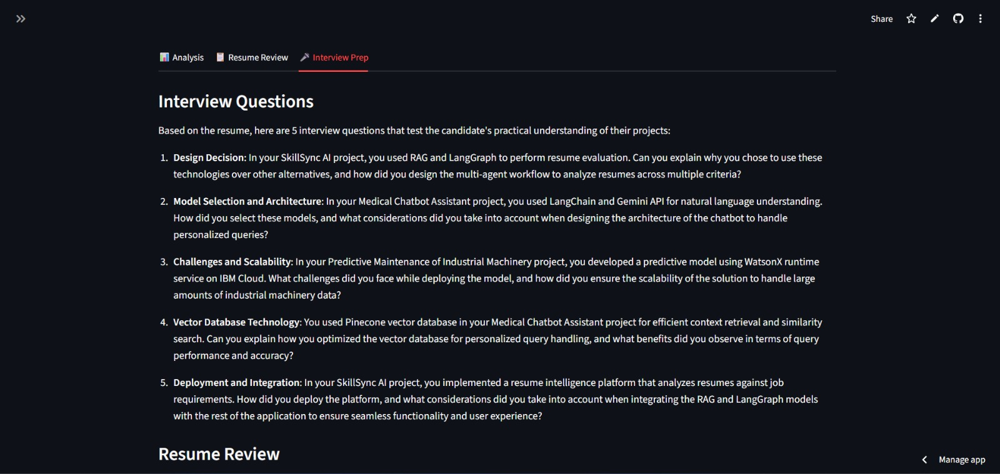

# SkillSync AI

🚀 Live Demo: https://skillsync-ai-project.streamlit.app

## Overview
SkillSync AI is a multi-agent resume intelligence platform that evaluates resumes against job descriptions, calculates ATS scores, identifies skill gaps, provides detailed resume reviews, and generates personalized interview questions.

## Features
- ATS Resume Scoring
- JD Skill Matching
- Missing Skill Detection
- Multi-Agent Resume Review (LangGraph)
- AI-Powered Feedback
- Interview Question Generation

## Tech Stack
- Python
- Streamlit
- LangGraph
- Groq LLM
- PyPDF2
- Prompt Engineering

## Home Screen

## Skills Matching

## Resume Review

## Interview Preparation

## Live Demo
https://skillsync-ai-project.streamlit.app
